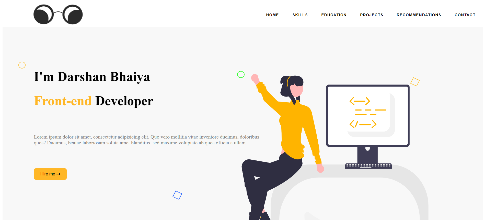
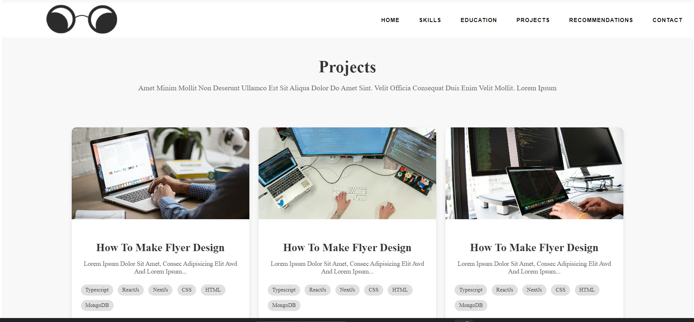
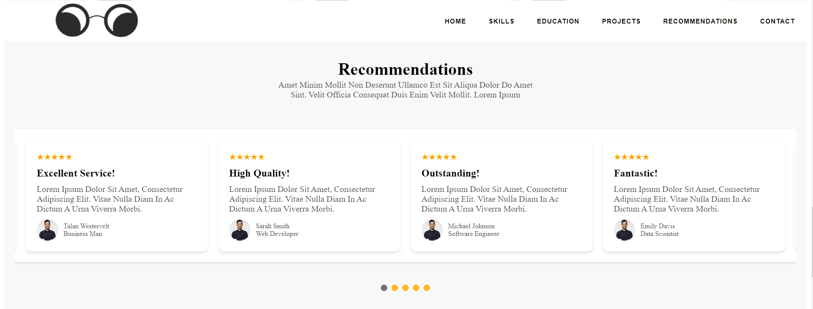

# Sample Portfolio Application

This is a sample portfolio application built using React. It showcases a simple and elegant design to present your projects and skills.






To get a local copy of the project up and running, follow these simple steps.

### Prerequisites

- Node.js and npm installed on your machine

### Installation

1. Clone the repository

2. Navigate to the project directory

3. Install the dependencies

   ```sh
   npm install
   ```

4. Start the development server

   ```sh
   npm run dev
   ```


